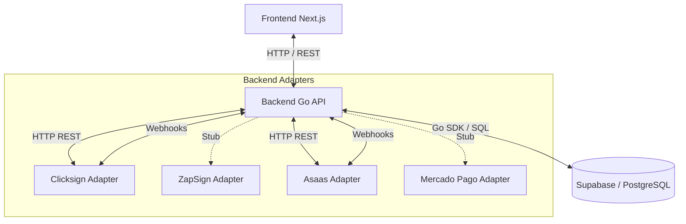
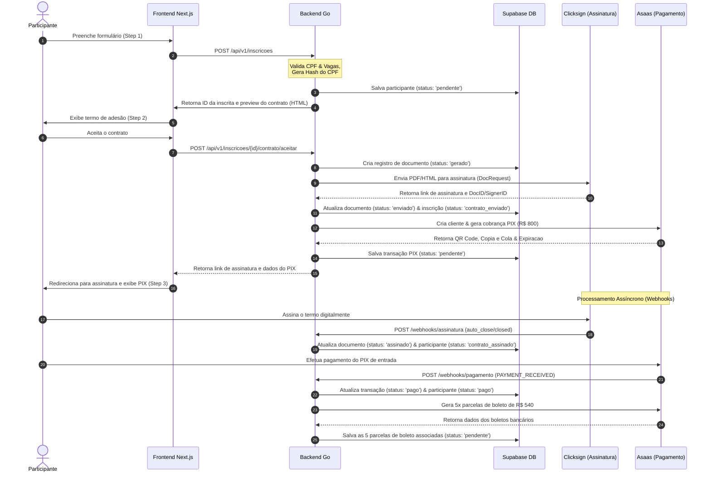

# afpro — Plataforma de Inscrições e Checkout ("Meninas na Pesca")

A **afpro** (Associação Feminina de Pesca Esportiva de Rondônia) desenvolveu esta plataforma integrada para automatizar o ciclo completo de inscrições, assinaturas de contratos de adesão e faturamento das edições do evento esportivo **"Meninas na Pesca"**.

O sistema é dividido em duas partes principais:
1. **Frontend**: Uma aplicação web em [Next.js](https://nextjs.org/) moderna e de alta performance, que consome dinamicamente temas visuais cadastrados no banco de dados e gerencia um formulário de inscrição em múltiplos passos.
2. **Backend**: Uma API REST robusta desenvolvida em [Go](https://go.dev/) seguindo o padrão de **Arquitetura Hexagonal (Ports & Adapters)**, responsável pelas integrações com provedores de pagamento (Asaas/Mercado Pago), assinaturas digitais (Clicksign/ZapSign) e manipulação segura de dados no Supabase.

---

## 🏗️ Arquitetura do Sistema

O projeto adota práticas avançadas de desacoplamento, segurança de dados em conformidade com a LGPD e flexibilidade de provedores externos.



### 1. Backend Go (internal/)
A estrutura interna do backend está organizada de forma a garantir que a lógica de negócios não dependa de frameworks ou serviços externos:
*   **`domain`**: Entidades puras do domínio (`Temporada`, `Participante`, `DocumentoAssinado`, `Transacao`), enums e constantes do sistema. Livre de dependências externas.
*   **`ports`**: Interfaces abstratas (contratos) que descrevem as operações necessárias com gateways externos (ex: `PagamentoGateway`, `AssinaturaGateway`).
*   **`adapters`**: Implementações concretas das portas:
    *   **Assinatura**: [Clicksign](https://clicksign.com/) (produção/real) e [ZapSign](https://zapsign.com.br/) (stub/reserva).
    *   **Pagamento**: [Asaas](https://www.asaas.com/) (produção/real) e [Mercado Pago](https://www.mercadopago.com.br/) (stub/reserva).
*   **`repository`**: Camada de persistência que faz a ponte com o Supabase (PostgreSQL) usando o Go SDK.
*   **`service`**: Serviços orchestradores da lógica de negócios (`InscricaoService`, `FinanceiroService`), executando validações (como de CPF hash e regras de negócios de vagas).
*   **`handler`**: Handlers HTTP REST (utilizando `go-chi/chi/v5`) e endpoints de recebimento de Webhooks com autenticação HMAC e validação de tokens.

### 2. Frontend Next.js (frontend/)
*   **Next.js 16 (App Router)** com React 19 e TypeScript.
*   **Tailwind CSS v4** estruturado para permitir variáveis de estilo dinâmicas no runtime.
*   **Engine de Temas Dinâmicos**: O layout lê os dados visuais do banco de dados (da temporada configurada como ativa) e injeta as variáveis CSS correspondentes (`cor_primaria`, `cor_secundaria`, `cor_fundo`, `cor_texto`, etc.) em tempo de execução.
*   **Multi-step Form**: Fluxo intuitivo guiado de ponta a ponta:
    1.  **Step 1: Cadastro**: Coleta de dados pessoais, LGPD e contato de emergência.
    2.  **Step 2: Contrato**: Apresentação visual do termo de adesão personalizado. Integração para direcionar a assinatura digital no provedor correspondente.
    3.  **Step 3: Pagamento**: Apresentação imediata do QR Code e código copia-e-cola do PIX de entrada.

### 3. Banco de Dados (Supabase / PostgreSQL)
*   **Segurança (LGPD)**: O CPF do participante nunca é armazenado em formato legível no banco de dados. O backend Go faz a sanitização e persiste apenas o hash SHA-256 (`cpf_hash`) e os últimos 4 dígitos (`cpf_last4`) para fins de exibição e busca segura sem duplicidades.
*   **Row Level Security (RLS)**: Todas as tabelas têm políticas RLS ativadas. A tabela `temporadas` possui acesso de leitura pública (necessário para o Next.js carregar o tema antes de qualquer autenticação), enquanto a escrita e o acesso a dados sigilosos das demais tabelas (`participantes`, `documentos_assinados`, `transacoes`) são restritos para chaves administrativas (`service_role`).
*   **Views Utilitárias**:
    *   `vw_temporada_ativa`: Retorna apenas os campos públicos da edição corrente e ativa.
    *   `vw_painel_inscricoes`: Consolida todas as inscrições, status dos documentos, pagamentos confirmados e parcelas faturadas para uso no dashboard admin.

---

## 🔄 Fluxo Completo de Inscrição e Faturamento



---

## 🛠️ Próximas Features (Roadmap / Backlog)

Com base no estado atual do sistema, as seguintes melhorias técnicas e funcionais estão planejadas para desenvolvimento:

### 1. Integrações & Provedores Alternativos (Adapters)
*   **Implementação Real do MercadoPagoAdapter**: Completar os métodos da interface [PagamentoGateway](file:///home/dieftsx/projects/afpro/backend/internal/ports/gateways.go#L48-L65) em [mercado_pago.go](file:///home/dieftsx/projects/afpro/backend/internal/adapters/pagamento/mercado_pago.go) usando a API oficial do Mercado Pago para servir como alternativa imediata ao Asaas.
*   **Implementação Real do ZapSignAdapter**: Completar os métodos da interface [AssinaturaGateway](file:///home/dieftsx/projects/afpro/backend/internal/ports/gateways.go#L96-L109) em [zapsign.go](file:///home/dieftsx/projects/afpro/backend/internal/adapters/assinatura/zapsign.go) usando a API oficial da ZapSign como alternativa ao Clicksign.
*   **Mecanismo de Failover Automatizado**: Implementar lógica no backend que alterna automaticamente entre os gateways de pagamento e assinatura se o provedor principal responder com erros de rede (5xx) ou indisponibilidade crítica.

### 2. Painel Administrativo (Dashboard)
*   **Interface de Gestão Admin (Frontend)**: Criar uma área restrita e segura no frontend (`/admin`) acessível apenas a administradores da afpro.
*   **Gestor de Temporadas (CRUD)**: Interface gráfica para criar novas temporadas, configurar o período de inscrições, definir vagas e parametrizar o tema visual (injetando as cores no banco de dados).
*   **Editor de Contrato (com Rich Text)**: Interface para edição do template do contrato com suporte a placeholders dinâmicos (visualização imediata).
*   **Exportação de Dados para Logística**: Recurso para baixar planilhas (CSV/Excel) de participantes com status de inscrição `'pago'` contendo informações cruciais de vestuário (Tamanho da Camisa, Balaclava, Boné) para a fábrica.
*   **Reconciliação e Controle Manual**: Permitir que administradores validem pagamentos offline, cancelem inscrições vencidas manualmente ou gerem novas cobranças avulsas caso ocorram problemas operacionais.

### 3. Resiliência e Autocorreção (Self-healing)
*   **Serviço de Reconciliação em Background (Cron/Workers)**:
    *   Um worker periódico para buscar o status atualizado na API do Clicksign para documentos que continuam com status `'enviado'` ou `'visualizado'` no banco após X horas, prevenindo que falhas temporárias nos webhooks travem a participante.
    *   Poller de conciliação financeira com o Asaas para garantir que transações PIX e parcelas de boletos pagas sejam processadas mesmo em caso de atraso na rede ou quedas do servidor do webhook.
*   **Fila de Retentativas (Retry Queue / DLQ)**: Implementar uma fila estruturada (usando Supabase Edge Functions, Redis ou DB Jobs) para garantir que a falha ao gerar os 5 boletos de parcelas após o PIX de entrada seja retentada automaticamente, em vez de exigir intervenção manual do admin.

### 4. Comunicação ativa & Notificações
*   **Disparos Inteligentes via WhatsApp e E-mail**:
    *   Notificar a participante imediatamente com o link de assinatura quando a inscrição for criada.
    *   Enviar o código copia-e-cola do PIX de entrada direto no WhatsApp/E-mail assim que o contrato for assinado.
    *   Alerta automático de proximidade de vencimento das parcelas de boleto.
    *   Integração planejada com providers como **Resend** (e-mail) e stubs para APIs de mensagens de WhatsApp (como Evolution API ou Z-API).

---

## ⚙️ Configuração do Ambiente e Execução

### Variáveis de Ambiente Necessárias

#### Backend Go (`backend/.env`)
Crie uma cópia do arquivo `.env.example` para `.env` e ajuste as variáveis:
```ini
APP_ENV=development
SERVER_PORT=8080
FRONTEND_URL=http://localhost:3000

SUPABASE_URL=https://xxxxxxxxxxxxxxxxxxx.supabase.co
SUPABASE_ANON_KEY=eyJhbGciOiJIUzI1NiIsInR5cCI6...
SUPABASE_SERVICE_ROLE_KEY=eyJhbGciOiJIUzI1NiIsInR5cCI6... # Requerido devido ao RLS

# Gateway de Pagamento
ASAAS_API_KEY=$aact_xxxxxxxxxxxxxxxxxxxxxxxxxx
ASAAS_BASE_URL=https://sandbox.asaas.com/api/v3
ASAAS_WEBHOOK_TOKEN=seu_token_secreto_webhook

# Gateway de Assinatura
CLICKSIGN_ACCESS_TOKEN=xxxxxxxx-xxxx-xxxx-xxxx-xxxxxxxxxxxx
CLICKSIGN_BASE_URL=https://sandbox.clicksign.com
CLICKSIGN_WEBHOOK_HMAC_KEY=seu_secret_hmac_webhook
```

#### Frontend Next.js (`frontend/.env.local`)
Configure a URL da API do backend e as credenciais públicas do Supabase:
```ini
NEXT_PUBLIC_API_URL=http://localhost:8080
NEXT_PUBLIC_SUPABASE_URL=https://xxxxxxxxxxxxxxxxxxx.supabase.co
NEXT_PUBLIC_SUPABASE_ANON_KEY=eyJhbGciOiJIUzI1NiIsInR5cCI6...
```

---

## 🚀 Como Executar Localmente

### 1. Banco de Dados (Supabase)
1. Crie um projeto no Supabase.
2. Acesse o **SQL Editor**, cole o conteúdo completo do arquivo [`001_initial_schema.sql`](file:///home/dieftsx/projects/afpro/001_initial_schema.sql) e execute. Isso criará todas as tabelas, enums, triggers, políticas de RLS, views e inserirá a semente com a 5ª Temporada ativa.

### 2. Iniciar o Backend (Go)
Certifique-se de ter o Go instalado (v1.22 ou superior):
```bash
cd backend
# Baixar dependências
go mod download
# Copiar env e configurar seus tokens de sandbox
cp .env.example .env
# Iniciar o servidor
go run cmd/api/main.go
```
O backend subirá em `http://localhost:8080`. Você pode verificar o status através do endpoint `http://localhost:8080/health`.

### 3. Iniciar o Frontend (Next.js)
```bash
cd frontend
# Instalar dependências
npm install
# Copiar env local
cp .env.local.example .env.local
# Iniciar o servidor de desenvolvimento
npm run dev
```
O frontend subirá em `http://localhost:3000`. Acesse no seu navegador para testar a landing page e simular o fluxo completo de inscrições!
